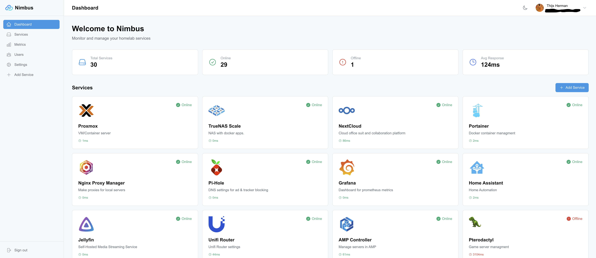

<div align="center">

# ☁️ Nimbus

### Your Homelab, Beautifully Organized

[](https://www.gnu.org/licenses/agpl-3.0)
[](https://go.dev/)
[](https://nextjs.org/)
[](https://www.docker.com/)

A modern, self-hosted dashboard for monitoring and managing your homelab services.
Multi-user support, real-time health checks, beautiful themes, and Prometheus metrics — all in one place.

<br />



<br />

[Getting Started](#-quick-start) · [Features](#-features) · [Documentation](#documentation) · [Roadmap](#roadmap)

</div>

---

## ✨ Features

<table>
<tr>
<td width="50%">

**🔐 Authentication & Security**
- Local accounts with JWT
- OAuth2 (Google, GitHub, Discord)
- Role-based access control
- Admin panel for user management

**📊 Service Monitoring**
- Real-time health checks
- Response time tracking
- Smart self-signed cert handling
- Status history & uptime graphs

</td>
<td width="50%">

**🎨 Personalization**
- Custom backgrounds per user
- Light/dark mode toggle
- Accent color themes
- Drag & drop service tiles

**📈 Metrics & Integration**
- Uptime checker
- Configurable check intervals
- Prometheus metrics support
- Mobile responsive design

</td>
</tr>
</table>

### Tech Stack

| Layer | Technology |
|-------|------------|
| **Frontend** | Next.js 16, React, TypeScript, Tailwind CSS |
| **Backend** | Go, Fiber framework |
| **Database** | PostgreSQL |
| **Deployment** | Docker, Docker Compose |

## Getting Started

### Prerequisites
- Node.js 20+
- Go 1.21+
- PostgreSQL (with pgAdmin for database management)
- Docker (optional, for production deployment only)

### 🚀 Quick Start

```bash
# 1. One-time setup
make setup

# 2. Create 'nimbus' database in PostgreSQL

# 3. Update .env (in root directory) with your PostgreSQL credentials

# 4. Test database connection
make testdb

# 5. Start development servers
make dev-backend    # Terminal 1
make dev-frontend   # Terminal 2
```

**Access your app:**
- Frontend: http://localhost:3000
- Backend API: http://localhost:8080/api/v1/health

**Need help?** Run `make` or `make help` to see all available commands.

### 🐳 Production Deployment with Docker

**For production or testing the full stack:**

1. Clone the repository:
```bash
git clone https://github.com/yourusername/nimbus.git
cd nimbus
```

2. Copy environment variables:
```bash
cp .env.example .env
# Edit .env with your configuration
```

3. Start the stack:
```bash
docker-compose up -d --build
```

4. Access the application:
- Frontend: http://localhost:3000
- Backend API: http://localhost:8080/api/v1/health

### Database Migrations

The backend uses golang-migrate for database migrations:

```bash
# Create a new migration
make migrate-create name=create_users_table

# Run migrations
make migrate-up

# Rollback migrations
make migrate-down
```

## Documentation

- **[README.md](README.md)** - This file - project overview and quick reference
- **[QUICKSTART.md](QUICKSTART.md)** - 5-minute setup guide
- **[TOOLING.md](TOOLING.md)** - Why we use Makefiles and npm scripts
- **[CLAUDE.md](CLAUDE.md)** - Project guidelines and coding conventions
- **[DEPRECATED.md](DEPRECATED.md)** - Old scripts and migration guide

## Project Structure

```
nimbus/
├── Makefile                 # Root-level development commands
├── backend/
│   ├── cmd/
│   │   └── server/
│   │       └── main.go         # Application entry point
│   ├── internal/
│   │   ├── config/             # Configuration management
│   │   ├── db/                 # Database connection and migrations
│   │   ├── handlers/           # HTTP request handlers
│   │   ├── middleware/         # HTTP middleware (auth, CORS, etc.)
│   │   ├── models/             # Data models
│   │   ├── repository/         # Database operations
│   │   ├── services/           # Business logic
│   │   └── utils/              # Utility functions
│   ├── go.mod
│   └── Makefile
├── frontend/
│   ├── app/                    # Next.js app router pages
│   ├── components/             # React components
│   ├── hooks/                  # Custom React hooks
│   ├── lib/                    # Utility functions and API client
│   ├── types/                  # TypeScript type definitions
│   ├── public/                 # Static assets
│   └── package.json
├── docker/
│   ├── backend.Dockerfile
│   ├── frontend.Dockerfile
│   └── nginx/
│       └── nginx.conf
├── docker-compose.yml
└── README.md
```

## API Documentation

### Authentication Endpoints
- `POST /api/v1/auth/register` - Register new user
- `POST /api/v1/auth/login` - User login
- `POST /api/v1/auth/refresh` - Refresh JWT token
- `POST /api/v1/auth/logout` - User logout

### Service Management
- `GET /api/v1/services` - List all services
- `GET /api/v1/services/:id` - Get specific service
- `POST /api/v1/services` - Create new service
- `PUT /api/v1/services/:id` - Update service
- `DELETE /api/v1/services/:id` - Delete service
- `PUT /api/v1/services/reorder` - Update service positions (drag & drop)
- `POST /api/v1/services/:id/check` - Manual health check

### Health Monitoring
- Automatic background health checks with configurable interval
- Visual status indicators (online/offline/unknown)
- Response time tracking

### Prometheus Metrics (Optional)
- `GET /api/v1/prometheus/metrics/user/:userID` - Prometheus metrics for specific user (requires API key)

## Environment Variables

**Important**: Environment variables are configured in **two `.env` files**:
- **Root `.env`** - Backend configuration (database, JWT, health checks, Prometheus)
- **`frontend/.env.local`** - Frontend configuration (API URL, app name)

See `.env.example` in the root directory for all available configuration options.

### Backend Variables (root `.env`)

**Database:**
- `DB_HOST`, `DB_PORT`, `DB_NAME`, `DB_USER`, `DB_PASSWORD` - PostgreSQL connection
- `DB_URL` - Alternative: full connection string (optional)

**Authentication & Security:**
- `JWT_SECRET` - Secret key for JWT tokens (**minimum 32 characters, CHANGE IN PRODUCTION!**)
- `JWT_EXPIRY` - Token expiration (e.g., `24h`, `7d`, `30d`)
- `BCRYPT_COST` - Password hashing cost (10-12 recommended)

**Server Configuration:**
- `PORT` - Backend API port (default: `8080`)
- `CORS_ORIGINS` - Comma-separated allowed origins (e.g., `http://localhost:3000`)
- `COOKIE_SECURE` - Set to `true` for HTTPS, `false` for local dev

**Health Checks:**
- `HEALTH_CHECK_INTERVAL` - Seconds between checks (default: `60`)
- `HEALTH_CHECK_TIMEOUT` - Request timeout in seconds (default: `10`)
- **Smart TLS Verification**: Automatically detects private/local IP addresses
  - Public services (e.g., `https://example.com`) → Full certificate verification ✅
  - Local services (e.g., `https://192.168.1.181:9443`) → Skips verification for self-signed certs ✅
  - Works for: Portainer, Proxmox, and other homelab services with self-signed certificates
  - Secure by default - no configuration needed!

**Metrics & Monitoring:**
- `METRICS_RETENTION_DAYS` - Days to retain status logs (default: `30`)
- `PROMETHEUS_API_KEY` - API key for Prometheus access (never expires)
  - Generate with: `openssl rand -hex 32`

### Frontend Variables (`frontend/.env.local`)

**API Configuration:**
- `NEXT_PUBLIC_API_URL` - Backend API URL from browser (optional, auto-detects if not set)
  - Example: `http://localhost:8080/api/v1` or `https://api.yourdomain.com/api/v1`
- `NEXT_PUBLIC_API_PORT` - Backend port for runtime detection (default: `8080`)
- `NEXT_PUBLIC_APP_NAME` - Application name (default: `Nimbus`)

**Note:** Frontend auto-detects API URL at runtime based on browser location. Only override if needed.

## Prometheus Integration (Optional)

Nimbus can export service metrics in Prometheus format for monitoring and alerting.

### Quick Setup

1. **Generate an API key:**
```bash
openssl rand -hex 32
```

2. **Add to `.env`:**
```bash
PROMETHEUS_API_KEY=your_generated_key_here
```

3. **Create `prometheus.yml`** (not tracked in git):
```yaml
global:
  scrape_interval: 30s

scrape_configs:
  - job_name: 'prometheus'
    static_configs:
      - targets: ['localhost:9090']

  - job_name: 'nimbus'
    scrape_interval: 30s
    metrics_path: '/api/v1/prometheus/metrics/user/YOUR_USER_ID'
    authorization:
      type: Bearer
      credentials: 'YOUR_API_KEY'
    static_configs:
      - targets: ['localhost:8080']  # Adjust to your Nimbus backend URL
```

4. **Deploy Prometheus with Docker:**
```bash
docker run -d \
  --name prometheus \
  -p 9090:9090 \
  -v $(pwd)/prometheus.yml:/etc/prometheus/prometheus.yml:ro \
  prom/prometheus:latest
```

5. **Get your user ID** from the database or login response, then update `prometheus.yml`

**Note:** All files in the `prometheus/` directory are gitignored. See `prometheus/SECURE_SETUP.md` for detailed setup instructions.

## Development Commands

### Quick Reference

Run `make` or `make help` to see all available commands.

### Common Commands

```bash
# Setup (first time)
make setup          # Copy .env.example to .env, install dependencies

# Development
make dev-backend    # Start backend (or: cd backend && make dev)
make dev-frontend   # Start frontend (or: cd frontend && npm run dev)

# Testing
make testdb         # Test database connection

# Utilities
make kill-ports     # Kill stuck processes on ports 8080/3000
make clean          # Clean build artifacts
```

### Backend Commands

```bash
cd backend

make dev        # Run development server
make build      # Build production binary
make test       # Run tests
make testdb     # Test database connection
make fmt        # Format code
make lint       # Run linter
```

### Frontend Commands

```bash
cd frontend

npm run dev     # Start development server
npm run build   # Build for production
npm run start   # Start production server
npm run lint    # Run linter
```

## Contributing

1. Fork the repository
2. Create your feature branch (`git checkout -b feature/amazing-feature`)
3. Commit your changes (`git commit -m 'feat: add amazing feature'`)
4. Push to the branch (`git push origin feature/amazing-feature`)
5. Open a Pull Request (our PR template will guide you)

## Roadmap

- [x] Initial project setup
- [x] User authentication (JWT)
- [x] CI/CD pipeline (GitHub Actions)
- [x] Database migrations
- [x] Auth pages (login, register)
- [x] Dashboard layout with sidebar
- [x] Service management CRUD
- [x] Health monitoring system
- [x] User theme customization
- [x] Role-based access control (admin features)
- [x] Docker deployment
- [x] Admin configuration UI
- [x] Service status history graphs
- [x] Prometheus metrics export
- [x] OAuth2 login support
- [ ] Widget/plugin system
- [x] Mobile responsive design
- [ ] PWA support

## License

This project is licensed under the GNU Affero General License - see the LICENSE file for details.

## Acknowledgments

- Inspired by Dashy, Homarr, and Homer
- Built with modern web technologies
- Designed for the homelab community/general use