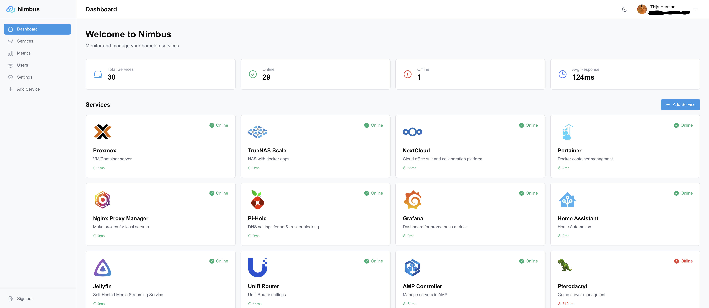

<div align="center">

# ☁️ Nimbus

### Your Homelab, Beautifully Organized

[](https://www.gnu.org/licenses/agpl-3.0)
[](https://go.dev/)
[](https://nextjs.org/)
[](https://www.docker.com/)

A modern, self-hosted dashboard for monitoring and managing your homelab services.
Multi-user support, real-time health checks, beautiful themes, and Prometheus metrics.

<br />



<br />

[Quick Start](#-quick-start) · [Features](#-features) · [Configuration](docs/CONFIGURATION.md) · [Contributing](#-contributing)

</div>

---

## ✨ Features

<table>
<tr>
<td width="50%">

**🔐 Authentication & Security**
- Local accounts with JWT
- OAuth2 (Google, GitHub, Discord)
- Role-based access control
- Admin panel for user management

**📊 Service Monitoring**
- Real-time health checks
- Response time tracking
- Smart self-signed cert handling
- Status history & uptime graphs

</td>
<td width="50%">

**🎨 Personalization**
- Custom backgrounds per user
- Light/dark mode toggle
- Accent color themes
- Drag & drop service tiles

**📈 Metrics & Integration**
- Configurable check intervals
- Prometheus metrics export
- Mobile responsive design

</td>
</tr>
</table>

### 🧩 Widgets & integrations (2.0, `dev` image)

Add widgets next to your services with **Add Widget** on the dashboard: Clock, Note (Markdown), Bookmarks, Embed, Weather, RSS and Custom API. Widget data is fetched by the server and pushed to the dashboard live. See [docs/WIDGETS.md](docs/WIDGETS.md).

Integrations show live numbers from your apps on a service tile. Add one under **Settings, Integrations**, then pick it under **Live numbers** when you edit the service. Credentials are stored encrypted with `ENCRYPTION_KEY`.

| App | Numbers on the tile | Sign in with |
|---|---|---|
| Sonarr | wanted, queued, series | API key |
| Radarr | wanted, queued, movies | API key |

---

## 🚀 Quick Start

Deploy Nimbus in under 30 seconds with Docker. **Zero configuration required!**

### 1. Create `docker-compose.yml`

```bash
mkdir nimbus && cd nimbus
curl -O https://raw.githubusercontent.com/Turbootzz/Nimbus/main/docker-compose.yml
```

Or create it manually:

<details>
<summary>docker-compose.yml</summary>

```yaml
services:
  db:
    image: turboot/nimbus-postgres:18
    container_name: nimbus-db
    restart: unless-stopped
    environment:
      POSTGRES_DB: nimbus
      POSTGRES_USER: nimbus
      POSTGRES_PASSWORD: ${DB_PASSWORD:-nimbus-default-password}
      PGDATA: /var/lib/postgresql/data
    volumes:
      - postgres_data:/var/lib/postgresql/data
    healthcheck:
      test: ["CMD-SHELL", "pg_isready -U nimbus -d nimbus"]
      interval: 10s
      timeout: 5s
      retries: 5

  nimbus:
    image: turboot/nimbus:latest
    container_name: nimbus
    restart: unless-stopped
    environment:
      DB_PASSWORD: ${DB_PASSWORD:-nimbus-default-password}
      JWT_SECRET: ${JWT_SECRET:-}
      ENCRYPTION_KEY: ${ENCRYPTION_KEY:-}
    volumes:
      - uploads_data:/app/backend/uploads
    ports:
      - "3000:3000"
    depends_on:
      db:
        condition: service_healthy

volumes:
  postgres_data:
  uploads_data:
```

</details>

### 2. Start Nimbus

```bash
docker-compose up -d
```

### 3. Open your browser

Navigate to **http://localhost:3000** and create your first account!

> **Note:** Secrets are auto-generated on first run. For production, see [Configuration](docs/CONFIGURATION.md) to set custom passwords.
>
> **Still on the separate `nimbus-backend` and `nimbus-frontend` images?** They no longer get updates. Switching to the unified image takes about 5 minutes and keeps all your data: see the [Migration Guide](docs/MIGRATION.md).

### Image tags

| Tag | What you get |
|-----|--------------|
| `latest` | Stable release (recommended) |
| `1.4.0`, `1.4`, `1` | A pinned version, for controlled upgrades and rollbacks |
| `beta`, `2.0.0-beta.1` | Pre-releases for testers |
| `dev` | Every commit on the `develop` branch; can break at any time |

> **Trying `dev` or `beta`?** Use [`docker-compose.dev.yml`](docker-compose.dev.yml) (`dev` by default, `NIMBUS_TAG=beta` for the pre-release). It runs on port 3001 with its own database, so pre-release migrations never touch your production data. Going back to `latest` on a database that ran `dev` or `beta` is not supported.

---

## ⚙️ Configuration

Nimbus uses **convention over configuration** — sensible defaults are applied automatically.

| Variable | Default | Description |
|----------|---------|-------------|
| `DB_PASSWORD` | `nimbus-default-password` | PostgreSQL password |
| `JWT_SECRET` | *auto-generated* | Auth secret (persisted in volume) |
| `ENCRYPTION_KEY` | *auto-generated* | Encrypts integration credentials (persisted in volume, back it up) |
| `DOCKER_SOCKET` | *(none)* | Docker socket the Docker integration may use, e.g. `/var/run/docker.sock` |
| `DB_HOST` | `db` | Database hostname |
| `DB_PORT` | `5432` | Database port |
| `DB_USER` | `nimbus` | Database username |
| `DB_NAME` | `nimbus` | Database name |

**For production**, set custom secrets in a `.env` file:
```bash
DB_PASSWORD=your-secure-password
JWT_SECRET=your-32-char-secret
```

**Need OAuth, Prometheus, or custom domains?** See the [Advanced Configuration Guide](docs/CONFIGURATION.md).

---

## ☁️ Don't want to self-host?

[**Nimbus Cloud**](https://nimbusapp.dev) is a managed hosting option for €5/month — same Nimbus, zero setup.

- No Docker, no server — just sign up and go
- Automatic SSL certificates & updates
- Your own subdomain (`you.nimbusapp.dev`)
- All features included, same as self-hosted

Nimbus is and will always be free and open source. Nimbus Cloud is simply for those who prefer a hosted solution.

[**Get Started →**](https://nimbusapp.dev)

---

## 💻 Local Development

### Prerequisites
- Node.js 24+ / Go 1.26+ / PostgreSQL

### Quick Start

```bash
# Clone and setup
git clone https://github.com/Turbootzz/Nimbus.git
cd nimbus
make setup

# Create 'nimbus' database in PostgreSQL
# Update .env with your credentials

# Start development
make dev-backend    # Terminal 1
make dev-frontend   # Terminal 2
```

Run `make help` for all available commands.

---

## 🤝 Contributing

1. Fork the repository
2. Create your feature branch (`git checkout -b feature/amazing-feature`)
3. Commit your changes (`git commit -m 'feat: add amazing feature'`)
4. Push to the branch (`git push origin feature/amazing-feature`)
5. Open a Pull Request

---

## 📚 Documentation

| Document | Description |
|----------|-------------|
| [Configuration Guide](docs/CONFIGURATION.md) | All environment variables, OAuth setup, Prometheus |
| [README.md](README.md) | Information about Nimbus |
| [DEVELOPMENT.md](docs/DEVELOPMENT.md) | 5-minute development setup |
| [WIDGETS.md](docs/WIDGETS.md) | Widget types, RSS and custom API paths |
| [INTEGRATIONS.md](docs/INTEGRATIONS.md) | Supported apps and how to add one |

---

## 📋 Roadmap

- [x] JWT & OAuth2 authentication
- [x] Real-time health monitoring
- [x] User themes & customization
- [x] Admin panel & RBAC
- [x] Prometheus metrics export
- [x] Mobile responsive design
- [x] Service groups
- [x] Card resizing & dashboard scaling
- [x] List view mode
- [x] Custom service icons (image uploads)
- [x] Uptime webhook notifications
- [x] Optional landing page
- [x] Zero-config Docker deployment
- [ ] Widgets and app integrations (in progress on `dev`)
- [ ] PWA support

---

## 🎨 Icon attributions

When you click "Auto-fetch icon", Nimbus may download an SVG from the following open-source icon collection via the jsDelivr CDN. The icon is cached in your `uploads/service-icons/` volume; the origin is never re-fetched for rendering.

- [Dashboard Icons](https://github.com/homarr-labs/dashboard-icons) — Apache License 2.0

You can point the curated lookup at a self-hosted mirror or disable it entirely with the `DASHBOARD_ICONS_BASE_URL` env var (see [.env.example](.env.example)).

## 📄 License

[GNU Affero General Public License v3](LICENSE)

---

<div align="center">

**Inspired by** [Dashy](https://github.com/Lissy93/dashy), [Homarr](https://github.com/ajnart/homarr), and [Homer](https://github.com/bastienwirtz/homer)

Made for the homelab community

</div>